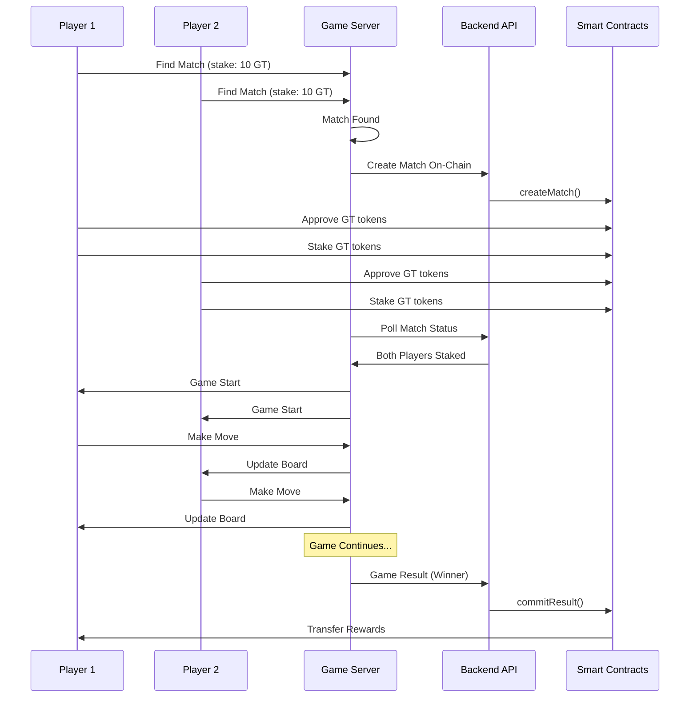

# 🎮 Tic-Tac-Toe dApp - Blockchain Gaming Platform

A complete, real-time, 2-player Tic-Tac-Toe game built on the Ethereum blockchain with integrated staking and reward system using ERC-20 tokens.


###Github repo link (both frontend and backend)
https://github.com/Kamal-dev-1999/wesee_assesment


###Github Frontend Repo link
https://github.com/Kamal-dev-1999/weseefrontend


## 🌟 Features

- **🔗 Blockchain Integration**: Full on-chain match creation, staking, and result settlement
- **⚡ Real-time Gameplay**: Socket.IO powered real-time game synchronization
- **💰 Token Staking**: Players stake GT tokens to participate in matches
- **🏆 Automated Rewards**: Winners automatically receive staked tokens on-chain
- **🔐 Wallet Integration**: MetaMask integration with persistent connection
- **🎯 Matchmaking**: Real-time player matching based on stake amounts
- **📱 Responsive UI**: Modern, dark-mode interface with smooth animations

## 🏗️ Architecture

```
┌─────────────────┐    ┌─────────────────┐    ┌─────────────────┐
│   Frontend      │    │   Game Server   │    │   Backend API   │
│   (React/JS)    │◄──►│   (Socket.IO)   │◄──►│   (Node.js)     │
└─────────────────┘    └─────────────────┘    └─────────────────┘
         │                       │                       │
         │                       │                       │
         ▼                       ▼                       ▼
┌─────────────────┐    ┌─────────────────┐    ┌─────────────────┐
│   MetaMask      │    │   Matchmaking   │    │   Smart         │
│   Wallet        │    │   Queue         │    │   Contracts     │
└─────────────────┘    └─────────────────┘    └─────────────────┘
```

## 🚀 Quick Start

### Prerequisites
- Node.js (v16+)
- MetaMask browser extension
- Sepolia testnet ETH for gas fees

### Installation

1. **Clone and Install Dependencies**
```bash
cd wesee/tic-tac-toe-app
npm install
```

2. **Start the Game Server**
```bash
npm start
```

3. **Open in Browser**
```
http://localhost:8081
```

## 🎮 How to Play

### 1. Connect Wallet


- Click "Connect Wallet" to connect your MetaMask
- Ensure you're on Sepolia testnet
- Your GT token balance will be displayed

### 2. Find a Match


- Enter your stake amount (in GT tokens)
- Click "Find Match" to enter the queue
- Wait for an opponent with the same stake amount

### 3. Stake Tokens


- **Approve GT tokens** for the PlayGame contract
- **Stake your tokens** to confirm participation
- Wait for both players to stake before game begins

### 4. Play the Game


- Take turns placing X's and O's on the 3x3 grid
- First player to get 3 in a row wins
- Game ends in draw if board is full

### 5. Collect Rewards
- **Winner**: Receives all staked tokens from both players
- **Loser**: Loses their staked tokens
- **Draw**: Both players get their tokens back

## 🔧 Technical Implementation

### Smart Contracts

#### GameToken.sol
```solidity
// ERC-20 token for game rewards
contract GameToken is ERC20, Ownable {
    function mint(address to, uint256 amount) external onlyTokenStore
}
```

#### PlayGame.sol
```solidity
// Manages match lifecycle and staking
contract PlayGame is Ownable, ReentrancyGuard {
    function createMatch(bytes32 matchId, address p1, address p2, uint256 stake) external
    function stake(bytes32 matchId) external
    function commitResult(bytes32 matchId, address winner) external
}
```

### Backend API Endpoints

#### Match Management
- `POST /match/start` - Create new match on-chain
- `GET /match/summary/:matchId` - Get match status and staking info
- `POST /match/result` - Commit game result and distribute rewards

#### Token Management
- `POST /purchase` - Buy GT tokens with USDT
- `POST /add-dummy-usdt` - Add test USDT to wallet
- `GET /balance/:address` - Check token balances

### Frontend Features

#### Wallet Integration
- Persistent MetaMask connection
- Auto-reconnect on page refresh
- Account switching support
- Chain validation (Sepolia testnet)

#### Real-time Gameplay
- Socket.IO for instant updates
- Live matchmaking queue
- Real-time game state synchronization
- Turn-based gameplay with validation

#### UI/UX Features
- Dark mode interface
- Responsive design
- Loading states and error handling
- Status updates and notifications

## 📊 Game Flow



## 🎨 UI Screenshots

### Main Interface


### Game in Progress


### Matchmaking


### Staking Process


## 🔗 API Documentation

### Match Endpoints

#### Create Match
```http
POST /match/start
Content-Type: application/json
X-API-KEY: dev

{
  "matchId": "0x...",
  "player1": "0x...",
  "player2": "0x...",
  "stake": "10"
}
```

#### Get Match Summary
```http
GET /match/summary/:matchId
```

Response:
```json
{
  "matchId": "0x...",
  "statusText": "STAKED",
  "bothPlayersStaked": true,
  "player1": "0x...",
  "player2": "0x...",
  "stake": "10"
}
```

#### Commit Result
```http
POST /match/result
Content-Type: application/json
X-API-KEY: dev

{
  "matchId": "0x...",
  "winner": "0x..."
}
```

## 🛠️ Development

### Project Structure
```
tic-tac-toe-app/
├── public/
│   ├── index.html          # Main HTML file
│   ├── client.js           # Frontend logic
│   └── styles.css          # Styling
├── server.js               # Game server (Socket.IO)
├── package.json            # Dependencies
└── README.md              # This file
```

### Key Technologies
- **Frontend**: HTML5, CSS3, Vanilla JavaScript, Ethers.js
- **Backend**: Node.js, Express.js, Socket.IO
- **Blockchain**: Ethereum (Sepolia), Solidity, Hardhat
- **Real-time**: Socket.IO for live communication

### Environment Variables
```env
PORT=8081
API_BASE=http://localhost:3000
API_KEY=dev
```

## 🧪 Testing

### Manual Testing
1. Open two browser windows
2. Connect different MetaMask accounts
3. Find match with same stake amount
4. Complete staking process
5. Play game and verify rewards

### Automated Testing
```bash
# Test API endpoints
cd ../wesee
npm run test-api

# Test smart contracts
npx hardhat test
```

## 🚀 Deployment

### Local Development
```bash
# Start backend API
cd wesee
npm run backend

# Start game server
cd tic-tac-toe-app
npm start
```

### Production Deployment
1. Deploy smart contracts to mainnet
2. Update contract addresses in frontend
3. Deploy backend API to cloud provider
4. Deploy frontend to CDN/hosting service

## 🔒 Security Features

- **Reentrancy Protection**: Smart contracts use ReentrancyGuard
- **Access Control**: Only authorized contracts can mint tokens
- **Input Validation**: All user inputs are validated
- **Transaction Verification**: All blockchain transactions are verified
- **Error Handling**: Comprehensive error handling and user feedback

## 📈 Performance

- **Real-time Updates**: < 100ms latency for game actions
- **Blockchain Integration**: Optimized gas usage for transactions
- **UI Responsiveness**: Smooth 60fps animations
- **Scalability**: Horizontal scaling support for multiple game servers

## 🤝 Contributing

1. Fork the repository
2. Create a feature branch
3. Make your changes
4. Add tests if applicable
5. Submit a pull request

## 📄 License

This project is licensed under the MIT License - see the LICENSE file for details.

## 🙏 Acknowledgments

- **Ethers.js**: Ethereum library for frontend integration
- **Socket.IO**: Real-time communication
- **Hardhat**: Ethereum development environment
- **OpenZeppelin**: Secure smart contract libraries

## 📞 Support

For questions or support:
- Create an issue on GitHub
- Check the documentation
- Review the smart contract code

---

**🎮 Ready to play? Connect your wallet and start staking!**


