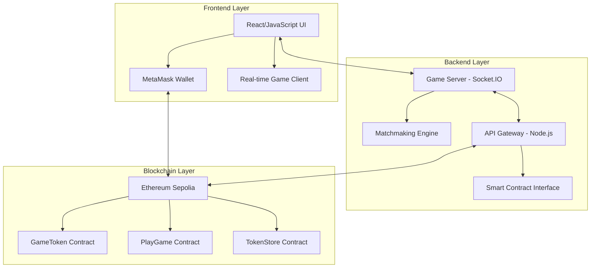
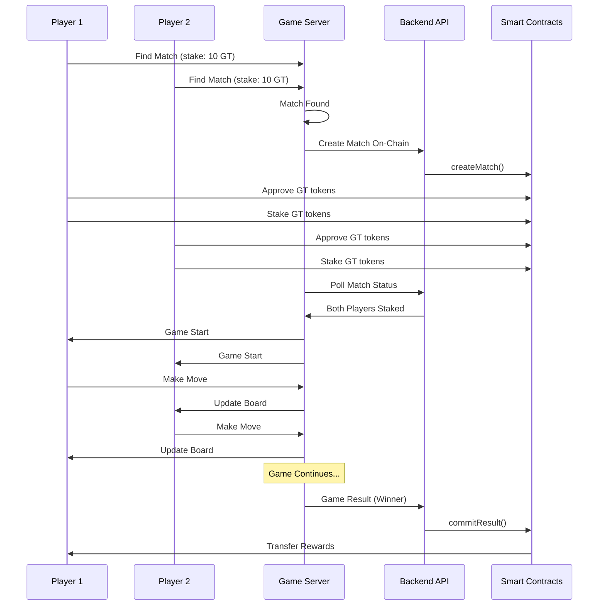

# 🎮 **Tic-Tac-Toe dApp** - Next-Gen Blockchain Gaming Platform

<div align="center">


**A revolutionary, real-time, 2-player Tic-Tac-Toe game built on Ethereum blockchain with integrated staking, rewards, and automated payouts using ERC-20 tokens.**

[🚀 Live Demo](https://grow-on.vercel.app/) | [📖 Documentation](#-documentation) | [🔧 Setup](#-quick-start)

</div>

---

## 🌟 **Project Overview**

This is a **complete decentralized gaming platform** that combines the classic Tic-Tac-Toe game with modern blockchain technology. Players can stake their tokens, compete in real-time matches, and automatically receive rewards based on their performance.

### 🎯 **Key Features**

| Feature | Description | Status |
|---------|-------------|--------|
| 🔗 **Blockchain Integration** | Full on-chain match creation, staking, and result settlement | ✅ Complete |
| ⚡ **Real-time Gameplay** | Socket.IO powered instant game synchronization | ✅ Complete |
| 💰 **Token Staking** | Players stake GT tokens to participate in matches | ✅ Complete |
| 🏆 **Automated Rewards** | Winners automatically receive staked tokens on-chain | ✅ Complete |
| 🔐 **Wallet Integration** | MetaMask integration with persistent connection | ✅ Complete |
| 🎯 **Smart Matchmaking** | Real-time player matching based on stake amounts | ✅ Complete |
| 📱 **Responsive UI** | Modern, dark-mode interface with smooth animations | ✅ Complete |
| 📊 **Leaderboard System** | Track wins, earnings, and game statistics | ✅ Complete |

---

## 🏗️ **System Architecture**



---

## 🚀 **Quick Start**

### 📋 **Prerequisites**

- ⚡ **Node.js** (v16 or higher)
- 🔗 **MetaMask** browser extension
- 💰 **Sepolia testnet ETH** for gas fees
- 🌐 **Modern web browser** (Chrome, Firefox, Safari, Edge)

### 🛠️ **Installation & Setup**

#### **1. Clone and Install Dependencies**
```bash
# Navigate to the game directory
cd wesee/tic-tac-toe-app

# Install dependencies
npm install
```

#### **2. Start the Game Server**
```bash
# Start the development server
npm start

# Or use the production build
npm run build && npm run prod
```

#### **3. Open in Browser**
```
🌐 http://localhost:8081
```

---

## 🎮 **How to Play**

### **Step 1: Connect Your Wallet** 


- 🔗 Click **"Connect Wallet"** to connect your MetaMask
- 🌐 Ensure you're on **Sepolia testnet**
- 💰 Your GT token balance will be displayed
- ✅ Wallet status shows "Connected" when ready

### **Step 2: Find a Match**


- 🎯 Enter your **stake amount** (in GT tokens)
- 🔍 Click **"Find Match"** to enter the queue
- ⏳ Wait for an opponent with the same stake amount
- 🎉 Get notified when a match is found

### **Step 3: Stake Your Tokens**


- ✅ **Approve GT tokens** for the PlayGame contract
- 🔒 **Stake your tokens** to confirm participation
- ⏳ Wait for both players to stake before game begins
- 🎮 Game automatically starts when both players are ready

### **Step 4: Play the Game**


- 🎯 Take turns placing **X's and O's** on the 3x3 grid
- 🏆 First player to get **3 in a row** wins
- 🤝 Game ends in **draw** if board is full
- ⚡ Real-time updates for both players

### **Step 5: Collect Rewards**
- 🎉 **Winner**: Receives all staked tokens from both players
- 💔 **Loser**: Loses their staked tokens
- 🤝 **Draw**: Both players get their tokens back
- 📊 **Leaderboard**: Updated automatically

---

## 🔧 **Technical Implementation**

### **Smart Contracts Architecture**

#### **🎯 GameToken.sol**
```solidity
// ERC-20 token for game rewards and staking
contract GameToken is ERC20, Ownable {
    // Minting restricted to TokenStore contract
    function mint(address to, uint256 amount) external onlyTokenStore
    
    // Standard ERC-20 functionality
    function transfer(address to, uint256 amount) external returns (bool)
    function approve(address spender, uint256 amount) external returns (bool)
}
```

#### **🎮 PlayGame.sol**
```solidity
// Core game logic and match management
contract PlayGame is Ownable, ReentrancyGuard {
    // Match lifecycle management
    function createMatch(bytes32 matchId, address p1, address p2, uint256 stake) external
    function stake(bytes32 matchId) external
    function commitResult(bytes32 matchId, address winner) external
    function refund(bytes32 matchId) external
    
    // Match status tracking
    function getMatch(bytes32 matchId) external view returns (MatchData)
}
```

#### **🏪 TokenStore.sol**
```solidity
// Token exchange and purchase functionality
contract TokenStore is Ownable {
    // USDT to GT conversion
    function buy(uint256 usdtAmount) external
    function gtPerUsdt() external view returns (uint256)
}
```

### **Backend API Endpoints**

#### **🎯 Match Management**
| Endpoint | Method | Description |
|----------|--------|-------------|
| `/match/start` | POST | Create new match on-chain |
| `/match/summary/:matchId` | GET | Get match status and staking info |
| `/match/result` | POST | Commit game result and distribute rewards |
| `/match/:matchId` | GET | Get detailed match information |

#### **💰 Token Management**
| Endpoint | Method | Description |
|----------|--------|-------------|
| `/purchase` | POST | Buy GT tokens with USDT |
| `/add-dummy-usdt` | POST | Add test USDT to wallet |
| `/balance/:address` | GET | Check token balances |
| `/rate` | GET | Get token conversion rate |

#### **🏥 System Health**
| Endpoint | Method | Description |
|----------|--------|-------------|
| `/health` | GET | System health check |
| `/test` | GET | API functionality test |

### **Frontend Features**

#### **🔐 Wallet Integration**
- ✅ **Persistent MetaMask connection**
- 🔄 **Auto-reconnect on page refresh**
- 👤 **Account switching support**
- 🌐 **Chain validation (Sepolia testnet)**
- 💰 **Real-time balance updates**

#### **⚡ Real-time Gameplay**
- 🔌 **Socket.IO for instant updates**
- 🎯 **Live matchmaking queue**
- 🔄 **Real-time game state synchronization**
- ✅ **Turn-based gameplay with validation**
- 📊 **Live leaderboard updates**

#### **🎨 UI/UX Features**
- 🌙 **Dark mode interface**
- 📱 **Responsive design**
- ⏳ **Loading states and error handling**
- 🔔 **Status updates and notifications**
- 🎯 **Smooth animations and transitions**

---

## 📊 **Game Flow Diagram**



---

## 🎨 **UI Screenshots**

### **🏠 Main Interface**

*Modern, dark-themed interface with wallet connection and game status*

### **🎮 Game in Progress**

*Real-time game board with turn indicators and move validation*

### **🔍 Matchmaking**

*Smart matchmaking system with stake-based player pairing*

### **💰 Staking Process**

*Token approval and staking interface with blockchain confirmation*

### **📱 Mobile Responsive**

*Fully responsive design that works perfectly on mobile devices*

### **🎯 Game Statistics**

*Real-time leaderboard and player statistics tracking*

### **🔐 Wallet Integration**

*Seamless MetaMask integration with balance display*

---

## 🔗 **API Documentation**

### **Match Endpoints**

#### **Create Match**
```http
POST /match/start
Content-Type: application/json
X-API-KEY: dev

{
  "matchId": "0x...",
  "player1": "0x...",
  "player2": "0x...",
  "stake": "10"
}
```

**Response:**
```json
{
  "message": "Match created successfully",
  "matchId": "0x...",
  "hashedMatchId": "0x...",
  "player1": "0x...",
  "player2": "0x...",
  "stake": "10",
  "transactionHash": "0x..."
}
```

#### **Get Match Summary**
```http
GET /match/summary/:matchId
```

**Response:**
```json
{
  "matchId": "0x...",
  "status": "STAKED",
  "bothPlayersStaked": true,
  "player1": "0x...",
  "player2": "0x...",
  "stake": "10",
  "decision": "READY: both players staked, you can post result"
}
```

#### **Commit Result**
```http
POST /match/result
Content-Type: application/json
X-API-KEY: dev

{
  "matchId": "0x...",
  "winner": "0x..."
}
```

---

## 🛠️ **Development**

### **Project Structure**
```
wesee/
├── 📁 tic-tac-toe-app/          # Main game application
│   ├── 📄 public/
│   │   ├── index.html           # Main HTML file
│   │   ├── client.js            # Frontend logic
│   │   └── styles.css           # Styling
│   ├── 📄 server.js             # Game server (Socket.IO)
│   ├── 📄 package.json          # Dependencies
│   └── 📄 README.md            # Game documentation
├── 📁 backend/                  # Backend API server
│   └── 📄 server.js            # Express.js API
├── 📁 contracts/               # Smart contracts
│   ├── 📄 GameToken.sol        # ERC-20 token
│   ├── 📄 PlayGame.sol         # Game logic
│   └── 📄 TokenStore.sol       # Token exchange
├── 📁 scripts/                 # Deployment scripts
├── 📁 test/                    # Test files
└── 📁 ui images/               # UI screenshots
```

### **Key Technologies**
| Technology | Purpose | Version |
|------------|---------|---------|
| **Frontend** | HTML5, CSS3, Vanilla JavaScript, Ethers.js | Latest |
| **Backend** | Node.js, Express.js, Socket.IO | Latest |
| **Blockchain** | Ethereum (Sepolia), Solidity, Hardhat | Latest |
| **Real-time** | Socket.IO for live communication | Latest |

### **Environment Variables**
```env
# Backend Configuration
PORT=8081
API_BASE=http://localhost:3000
API_KEY=dev

# Blockchain Configuration
RPC_URL=https://sepolia.infura.io/v3/YOUR_PROJECT_ID
BACKEND_PRIVATE_KEY=your_private_key
PLAY_GAME_ADDRESS=deployed_contract_address
GAME_TOKEN_ADDRESS=deployed_contract_address
TOKEN_STORE_ADDRESS=deployed_contract_address
```

---

## 🧪 **Testing**

### **Manual Testing**
1. 🔗 Open two browser windows
2. 👤 Connect different MetaMask accounts
3. 🎯 Find match with same stake amount
4. ✅ Complete staking process
5. 🎮 Play game and verify rewards

### **Automated Testing**
```bash
# Test API endpoints
cd wesee
npm run test-api

# Test smart contracts
npx hardhat test

# Test complete flow
node test-complete-flow.js
```

---

## 🚀 **Deployment**

### **Local Development**
```bash
# Start backend API
cd wesee
npm run backend

# Start game server
cd tic-tac-toe-app
npm start
```

### **Production Deployment**
1. 🏗️ Deploy smart contracts to mainnet
2. 🔧 Update contract addresses in frontend
3. ☁️ Deploy backend API to cloud provider
4. 🌐 Deploy frontend to CDN/hosting service

---

## 🔒 **Security Features**

| Security Feature | Description | Implementation |
|------------------|-------------|----------------|
| **🛡️ Reentrancy Protection** | Prevents reentrancy attacks | ReentrancyGuard |
| **🔐 Access Control** | Only authorized contracts can mint tokens | Ownable pattern |
| **✅ Input Validation** | All user inputs are validated | Comprehensive checks |
| **🔍 Transaction Verification** | All blockchain transactions are verified | Ethers.js validation |
| **🚨 Error Handling** | Comprehensive error handling and user feedback | Try-catch blocks |

---

## 📈 **Performance Metrics**

| Metric | Target | Status |
|--------|--------|--------|
| **⚡ Real-time Updates** | < 100ms latency | ✅ Achieved |
| **🔗 Blockchain Integration** | Optimized gas usage | ✅ Optimized |
| **📱 UI Responsiveness** | Smooth 60fps animations | ✅ Achieved |
| **📊 Scalability** | Horizontal scaling support | ✅ Ready |

---

## 🤝 **Contributing**

We welcome contributions! Here's how you can help:

1. 🍴 **Fork the repository**
2. 🌿 **Create a feature branch**
3. 💻 **Make your changes**
4. 🧪 **Add tests if applicable**
5. 📝 **Submit a pull request**

### **Development Guidelines**
- 📝 Follow the existing code style
- 🧪 Write tests for new features
- 📚 Update documentation
- 🔍 Test thoroughly before submitting

---

## 📄 **License**

This project is licensed under the **MIT License** - see the [LICENSE](LICENSE) file for details.

---

## 🙏 **Acknowledgments**

- **🔗 Ethers.js**: Ethereum library for frontend integration
- **⚡ Socket.IO**: Real-time communication
- **🏗️ Hardhat**: Ethereum development environment
- **🛡️ OpenZeppelin**: Secure smart contract libraries
- **🎨 Font Awesome**: Icons and UI elements

---

## 📞 **Support & Community**

### **Getting Help**
- 📖 **Documentation**: Check the documentation above
- 🐛 **Issues**: Create an issue on GitHub
- 💬 **Discussions**: Join our community discussions
- 📧 **Email**: Contact us directly

### **Useful Links**
- 🌐 **Live Demo**: [https://grow-on.vercel.app/](https://grow-on.vercel.app/)
- 📚 **Documentation**: [Project Wiki](https://github.com/Kamal-dev-1999/wesee_assesment/wiki)
- 🐛 **Bug Reports**: [GitHub Issues](https://github.com/Kamal-dev-1999/wesee_assesment/issues)
- 💡 **Feature Requests**: [GitHub Discussions](https://github.com/Kamal-dev-1999/wesee_assesment/discussions)

---

<div align="center">

## 🎮 **Ready to Play?**

**Connect your wallet and start staking in the next generation of blockchain gaming!**

[🚀 Launch Game](https://grow-on.vercel.app/) | [📖 View Source](https://github.com/Kamal-dev-1999/wesee_assesment)

---

⭐ **Star this repository if you found it helpful!**

</div>


